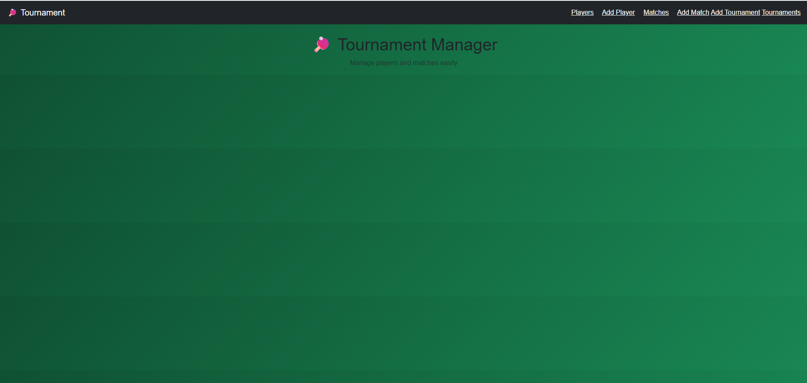
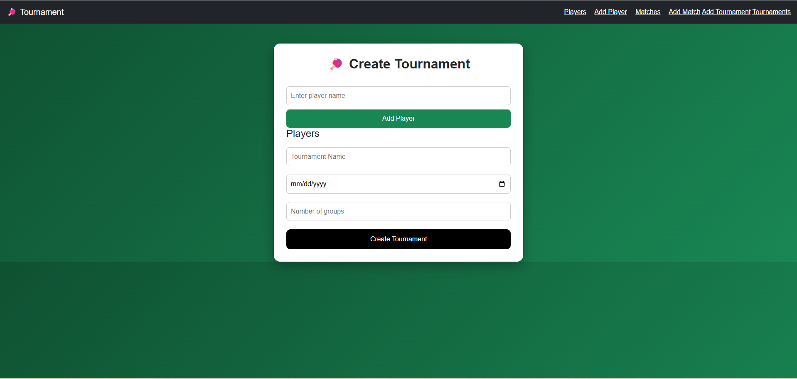
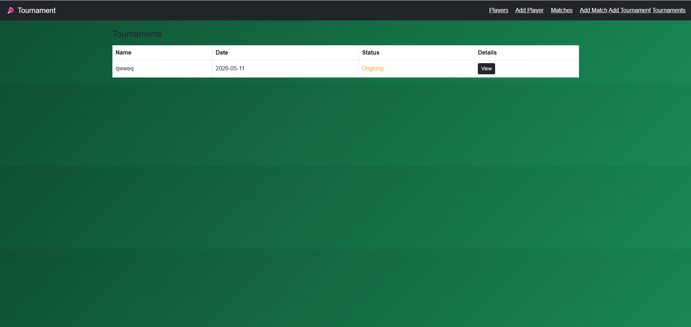
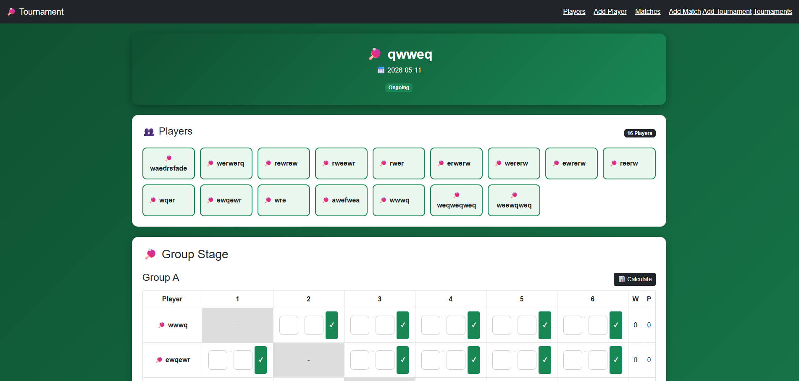
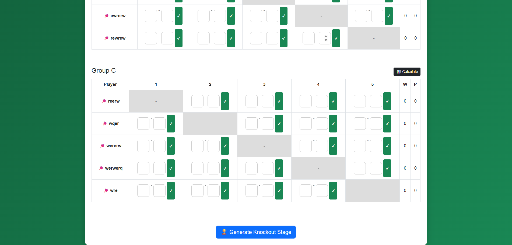

# Table Tennis Tournament Management System

A full-featured tournament management system built using Flask, Python, SQL, and Jinja2.

This project allows users to create tournaments, manage players, generate matches, track match statistics, and dynamically handle tournament progression.

---

# Features

* Tournament creation and management
* Player registration system
* Match generation system
* Group stage handling
* Tournament progression logic
* Match statistics tracking
* Dynamic ranking system
* Persistent database storage
* Responsive interface using Jinja2 templates

---

# Technologies Used

* Python
* Flask
* Jinja2
* SQLite
* HTML/CSS
* Git & GitHub

---

# Project Structure

```text id="m3sqf4"
static/
templates/
main.py
requirements.txt
README.md
```

---

# Installation

Clone the repository:

```bash id="7ns5kk"
git clone https://github.com/mohammed-awaes/table-tennis-tournament-system.git
```

Install dependencies:

```bash id="mx1x0z"
pip install -r requirements.txt
```

Run the application:

```bash id="5b9a0w"
python main.py
```

---

# Future Improvements

* Authentication system
* PostgreSQL integration
* REST API support
* Admin dashboard
* Live tournament updates
* Cloud deployment

---

# Screenshots

## Home Page



---

## Create Tournament



---

## Tournaments Page



---

## Tournament Details



---

## Group Stage System




---

# Author

Mohammed Awaes
Software Engineering Student & Backend Developer
